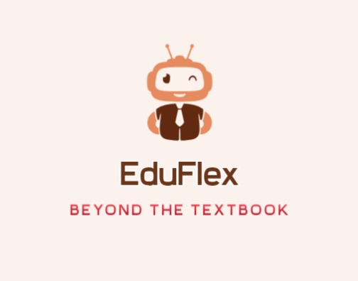

Deployment Link - https://eduflex-lscy.onrender.com

# Unleash the Power of *EduFlex* - One Platform for Schools and Students 

*Imagine a platform that revolutionizes education, empowering schools and students to thrive in the ever-evolving world. This is not a dream; it's the reality we're building with our innovative website!*

## *Inspiration* -
The education landscape, despite advancements in technology and societal shifts, often resembles a stagnant clock. This static approach leaves graduates unprepared for the ever-evolving demands of the modern world, even those with inherent capabilities. This challenge is particularly acute in rural areas, where limited access to contemporary knowledge can lead students to believe that curriculum alone guarantees success, a misconception hindering their potential. We believe it's time for a paradigm shift.  This platform aims to disrupt the status quo, empowering students to transcend curriculum limitations and actively shape their futures.

##  *Emphasize Accessibility and Effortlessness:*
- ### *24/7 AI-powered Chatbot:*
 Struggling with a concept? Our intelligent chatbot is your friendly guide, ready to answer your questions anytime, anywhere. No more waiting for office hours!

- ### *Visual Doubt Solving:*
 Stuck on a textbook problem? Simply snap a picture, upload it, and get an explanation tailored to your specific needs. Visual learning on overdrive!

##  *Curriculum that Keeps Pace with the Times:*

- ### *Dynamic Curriculum Updates:*
 Our curriculum stays ahead of the curve, seamlessly integrating the latest advancements in both tech and non-tech fields. Ensure your students are equipped with the most relevant knowledge for the future.

- ### *Trending Topics Demystified:*
 Dive deep into the hottest topics in the world today. Uncover foundational concepts and explore possibilities through engaging content. Future-proof your skillset with every click.

## *Empowering Schools, Franchising Success:*

- Effortless Franchise Management: We provide a seamless franchise system, allowing schools to leverage our cutting-edge features and instantly enhance their educational offerings. Say goodbye to complex setups, embrace a future-proof learning environment.

## *Your Feedback Matters:*
- Continuous Improvement through Feedback: We believe in evolving with your needs. Share your feedback through a user-friendly system, allowing us to constantly improve the platform's experience and deliver the best possible service.

## *What's next for EduFlex -*
### *Attendance Made Easy (and Secure):*

  Image-Based Attendance System: Eliminate tedious roll calls! Our secure, image-based system ensures accurate attendance tracking while saving valuable class time. 
No more room for errors, just efficient attendance management.

## *Personalized Career Assistance:* 
 - Whether your passion lies in online learning, traditional classrooms, or something entirely different, we'll guide you. Explore options, find the perfect fit, and chart your career map with confidence.
- Human Touch & AI Insights: Combine the best of both worlds with our online and offline assistants. Get personalized advice from experts and let AI analyze your strengths to suggest ideal career paths.

## *Challenges we faced* -
- *Integrating Chatbot with Website.*
- *leveraging cutting-edge APIs like Vertex and Gemini.*
- *While integrating Face-Recognition for attendance management.*

## *Technologies & Tools Used -*
- *Frontend: HTML, CSS, JavaScript*
- *Backend: NodeJS, ExpressJS, MongoDB Atlas*
- *Framework: BootStrap, ejs*
- *Deployment: Render*
- *Google Tools: Vertex AI, Gemini(API)*

## *Buisness Model* - 

- Sponsorships and Partnerships: Collaborate with government agencies, NGOs, corporate sponsors, and educational institutions to sponsor youth programs, workshops, and community projects on the platform.
- Advertising and Sponsorship: Generate revenue through targeted advertising and sponsorship opportunities, showcasing products and services relevant to youth audiences.
- Membership Fees: Offer subscription-based access to premium features and services on the platform for Schools.